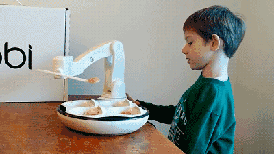
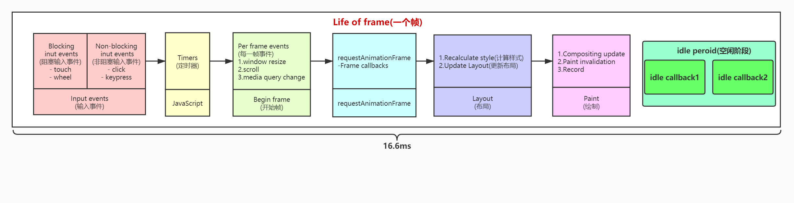
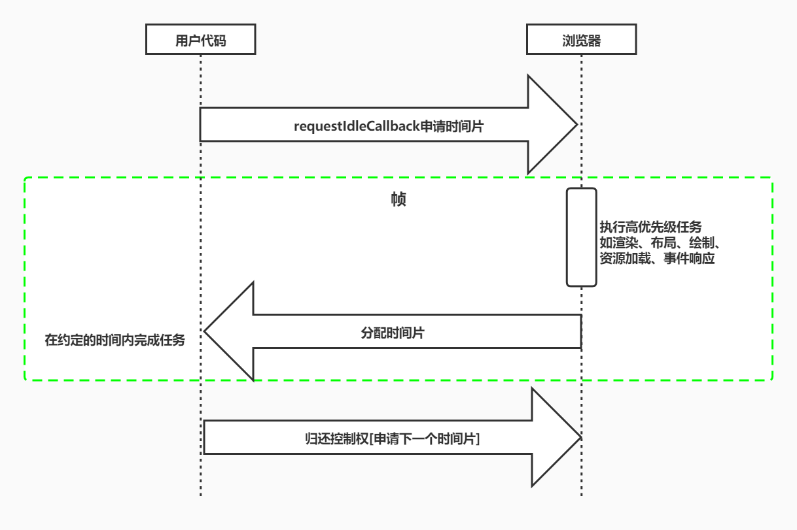

## 屏幕刷新率 & 帧

### 屏幕刷新率

- 目前大多数设备的屏幕刷新率为 60 次/秒
- 浏览器渲染动画或页面的每一帧的速率也需要跟设备屏幕的刷新率保持一致
- 页面是一帧一帧绘制出来的，当每秒绘制的帧数（FPS）达到 60 时，页面是流畅的,小于这个值时，用户会感觉到卡顿
- 每个帧的预算时间是 16.66 毫秒 (1 秒/60)
- 1s 60 帧，所以每一帧分到的时间是 1000/60 ≈ 16 ms。所以我们书写代码时力求不让一帧的工作量超过 16ms



### life of frame

- 每个帧的开头包括样式计算、布局和绘制
- 如果某个任务执行时间过长，浏览器会推迟渲染



- 输入事件：优先级最高，以让用户得到最快反馈
- timers：定时器到时间的回调
- GUI 渲染和 script 引擎是同一个线程，互斥，是性能优化的基础

## 2.1 [rAF](https://developer.mozilla.org/zh-CN/docs/Web/API/Window/requestAnimationFrame)

`requestAnimationFrame`回调函数会在绘制之前执行

```html
<!DOCTYPE html>
<html lang="en">
  <head>
    <meta charset="UTF-8" />
    <meta name="viewport" content="width=device-width, initial-scale=1.0" />
    <title>RAF</title>
  </head>

  <body>
    <p>在页面上绘制一个进度条值 0% => 100%</p>
    <div
      id="progressBar"
      style="background: lightblue; width: 0; height: 20px"
    ></div>
    <button id="btn">开始</button>
    <script>
      /**
       * requestAnimationFrame(callback) 由浏览器专门为动画提供的API
       * cancelAnimationFrame(返回值) 清除动画
       * <16.7 丢帧
       * >16.7 跳跃 卡顿
       */
      const div = document.querySelector("#progressBar");
      const button = document.querySelector("#btn");
      let start;
      function progress(current) {
        div.style.width = div.offsetWidth + 1 + "px";
        div.innerHTML = div.offsetWidth + "%";
        if (div.offsetWidth < 100) {
          // 打印开始准备执行的时候到真正执行的时间的时间差
          if (start === undefined) start = timestamp;
          console.log(parseInt(current - start));
          start = current;
          requestAnimationFrame(progress);
        }
      }
      button.onclick = () => {
        div.style.width = 0;
        start = Date.now();
        requestAnimationFrame(progress); // progress会在下次渲染前执行
      };
    </script>
  </body>
</html>
```

### 2.2 [requestIdleCallback](https://developer.mozilla.org/zh-CN/docs/Web/API/Window/requestIdleCallback)

- 我们希望快速响应用户，让用户觉得够快，不能阻塞用户的交互
- `requestIdleCallback` 使开发者能够在主事件循环上执行后台和低优先级工作，而不会影-响延迟关键事件，如动画和输入响应
- 正常帧任务完成后没超过 16ms,说明时间有富余，此时就会执行 `requestIdleCallback` 里注册的任务



```ts
window.requestIdleCallback(
  callback: (deaLine: IdleDeadline) => void,
  option?: {timeout: number}
  )

interface IdleDeadline {
  didTimeout: boolean // 表示任务执行是否超过约定时间
  timeRemaining(): DOMHighResTimeStamp // 任务可供执行的剩余时间
}
```

- callback：回调即空闲时需要执行的任务，该回调函数接收一个 IdleDeadline 对象作为入参。其中 IdleDeadline 对象包含：
  - didTimeout，布尔值，表示任务是否超时，结合 timeRemaining 使用
  - timeRemaining()，表示当前帧剩余的时间，也可理解为留给任务的时间还有多少
- options：目前 options 只有一个参数
  - timeout。表示超过这个时间后，如果任务还没执行，则强制执行，不必等待空闲

```html
<!DOCTYPE html>
<html lang="en">
  <head>
    <meta charset="UTF-8" />
    <meta http-equiv="X-UA-Compatible" content="IE=edge" />
    <meta name="viewport" content="width=device-width, initial-scale=1.0" />
    <title>requestIdleCallback</title>
  </head>
  <body>
    <script>
      // 在js里实现睡眠功能
      function sleep(delay) {
        for (var t = Date.now(); Date.now() - t <= delay; );
      }
      // 一个个小任务
      const works = [
        () => {
          logger("第1个任务开始");
          sleep(8);
          logger("第1个任务结束");
        },
        () => {
          logger("第2个任务开始");
          sleep(1000); // 一帧16.6ms，因为此任务的执行时间已经超过了16.6ms,所需要把控制权交给浏览器
          // 剩余时间没执行完requestIdleCallback，则会卡在这里
          logger("第2个任务结束");
        },
        () => {
          logger("第3个任务开始");
          sleep(5);
          logger("第3个任务结束");
        },
      ];
      // 每次取出一个任务执行
      function performUnitOfWork() {
        works.shift()();
      }
      function logger(content) {
        console.log(content);
      }
      /**
       * deadline: {timeRemaining, didTimeout}
       * timeRemaining(): 返回此帧还剩多少时间供用户使用
       * didTimeout: 此callback任务是否超时
       */
      function workLoop(deadline) {
        logger(`本帧剩余${parseInt(deadline.timeRemaining())}ms`); // 一般是个小于16ms的值
        while (
          (deadline.timeRemaining() > 1 || deadline.didTimeout) &&
          works.length > 0
        ) {
          logger(`还剩${parseInt(deadline.timeRemaining())}ms`);
          performUnitOfWork();
          logger(`还剩${parseInt(deadline.timeRemaining())}ms`);
        }
        // 如果没有剩余时间了,就放弃执行任务控制权,执行权交还给浏览器
        if (works.length > 0) {
          logger(
            `还剩${parseInt(
              deadline.timeRemaining()
            )}ms,时间片到了,等待下次空闲时间的调度`
          );
          requestIdleCallback(workLoop);
        }
      }
      /**
       * 取出workLoop任务执行
       * 这是一个全局属性/方法
       * 我作为用户,告诉浏览器,我现在执行callback函数,但是它的优先级比较低,可以在空闲的时候执行callback
       * timeout: 500: 但是如果到了timeout超时时间了,即使没有空闲时间也得执行，必须马上执行
       */
      requestIdleCallback(workLoop, { timeout: 500 });
    </script>
  </body>
</html>
```

ps:

- 不要在空闲时间 idle 操作 dom，引起重新渲染
- 这个调度方式叫合作式调度,需要浏览器相信用户写的代码
  但是如果用户写代码时,或者执行时间超过给的剩余时间,浏览器没有办法
